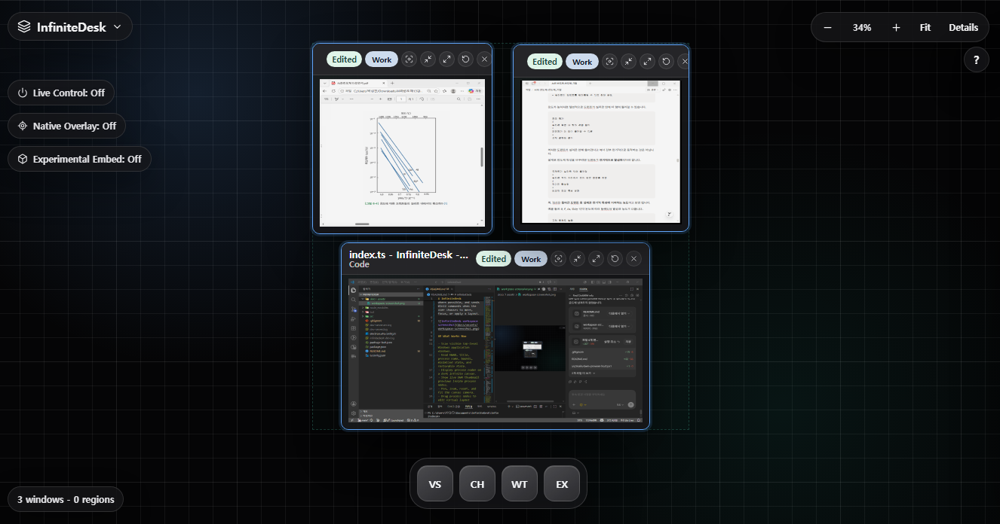

# InfiniteDesk

InfiniteDesk is a Windows desktop controller that lets you view, arrange, save, and restore real application windows on a spatial canvas.

It does not replace Windows Explorer or act as a shell. Real applications remain real OS windows. InfiniteDesk scans those windows by HWND, renders them as process nodes, shows live DWM previews where possible, and sends Win32 commands when the user chooses to move, focus, or apply a layout.



## What Works Now

- Scan visible top-level Windows application windows.
- Read HWND, title, process name, bounds, minimized state, and restorable state.
- Display process nodes on a dark infinite canvas.
- Show live DWM thumbnail previews inside process nodes.
- Pan, zoom, reset, and fit the canvas camera.
- Drag process nodes to edit virtual layout positions.
- Create Template Regions with Ctrl + drag.
- Assign windows to regions by moving their center point into a region.
- Save regions as layout templates.
- Restore saved templates.
- Apply the current canvas layout to real Windows windows.
- Focus, minimize, maximize, restore, close, and Work in a real window.
- Launch default pinned apps from the bottom Dock.
- Use Live Control mode to move real windows immediately while dragging.
- Use Native Overlay mode as a translucent control layer over the desktop.
- Experimentally reparent real windows into InfiniteDesk nodes with Win32 `SetParent`.

## Design Direction

InfiniteDesk is moving toward a Native Overlay + Live Window Control model.

The main workflow is:

1. InfiniteDesk gives a spatial overview of running processes.
2. DWM thumbnails provide live visual previews inside canvas nodes.
3. Real interaction still happens in the actual Windows application.
4. InfiniteDesk controls those windows through HWND-based Win32 commands.

DWM thumbnails are useful for overview, but they are not a direct input surface. Experimental reparenting can make a real application appear inside a node, but it is not stable enough to be the default direction.

## Requirements

- Windows 10 or Windows 11
- Node.js 20 or newer recommended
- npm
- PowerShell 5.1, included with Windows

## Getting Started

Install dependencies:

```bash
npm install
```

Run the app in development:

```bash
npm run dev
```

Validate the project:

```bash
npm run typecheck
npm run build
npm audit
```

## Usage

1. Start InfiniteDesk.
2. Use the floating `InfiniteDesk` menu or press Ctrl+R to scan windows.
3. Pan or zoom the canvas to inspect running processes.
4. Drag process nodes to arrange a virtual layout.
5. Ctrl + drag on empty canvas to create a Template Region.
6. Drag process nodes into a region to assign them.
7. Click `Save Regions` to persist region templates.
8. Click `Apply Layout` to move real Windows windows to the current virtual layout.
9. Click `Work` on a node to focus the real app and minimize InfiniteDesk.

## Keyboard Shortcuts

- Ctrl+R: Scan Windows
- Ctrl+S: Save Regions
- Ctrl+Enter: Apply Layout
- Ctrl+0: Fit View
- Ctrl+Shift+O: Toggle Native Overlay
- Esc: Close floating menus and drawers

## Architecture

```text
React Renderer
  |
  | context-isolated preload API
  v
Electron Main Process
  |
  +-- PowerShell Win32 scanner/control script
  |     |
  |     +-- EnumWindows / GetWindowText / GetWindowRect
  |     +-- MoveWindow / SetWindowPos
  |     +-- ShowWindow / SetForegroundWindow
  |     +-- SetParent / GetParent for experimental embed mode
  |
  +-- DWM preview host process
        |
        +-- DwmRegisterThumbnail
        +-- DwmUpdateThumbnailProperties
```

Templates are stored in Electron `userData/templates.json`.

## Project Structure

```text
src/
  main/
    index.ts              Electron main process and IPC handlers
    windows.ps1           Win32 scanning and window control script
    dwm-preview-host.ps1  DWM live preview host
  preload/
    index.ts              Safe renderer IPC bridge
  renderer/
    main.tsx              React app shell
    styles.css            Canvas, dock, drawer, and control styling
    canvas/               Coordinate, layout, and region helpers
    components/           Canvas and Dock components
    dock/                 Default Dock app definitions
  shared/
    types.ts              Shared IPC and domain types
docs/
  assets/
    workspace-screenshot.png
```

## Current Limitations

- DWM previews are visual only. They do not directly forward mouse or keyboard input.
- Experimental embed mode can behave differently across apps and should be treated as unstable.
- Chrome, Edge, VS Code, Electron apps, and elevated/admin windows may reject or behave oddly under native control.
- Focus commands are limited by Windows foreground restrictions.
- Multi-monitor layout persistence is not deeply modeled yet.
- Dock apps are currently defined in code instead of discovered from the Start Menu.
- DWM previews are hosted as overlay windows, so screenshot tools and z-order behavior can vary by environment.

## Next Steps

- Harden Native Overlay recall and click-through behavior.
- Add region-level apply and launch actions.
- Add persistent Dock app editing.
- Improve multi-monitor layout handling.
- Replace PowerShell hot paths with a native helper for smoother live movement.
- Keep DWM previews for overview while preserving real-window control as the main interaction model.
