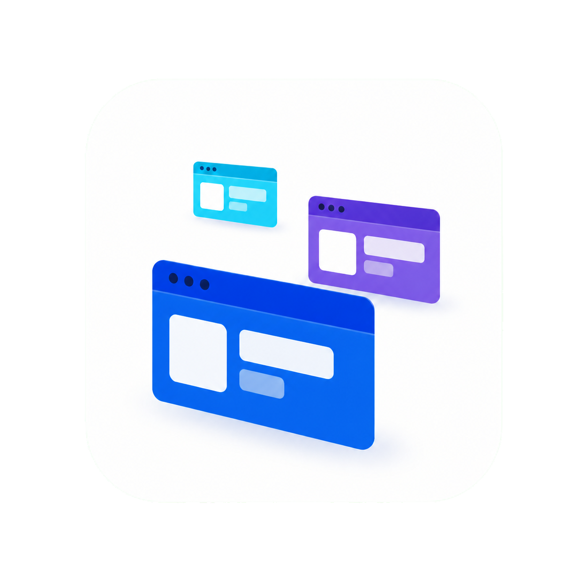
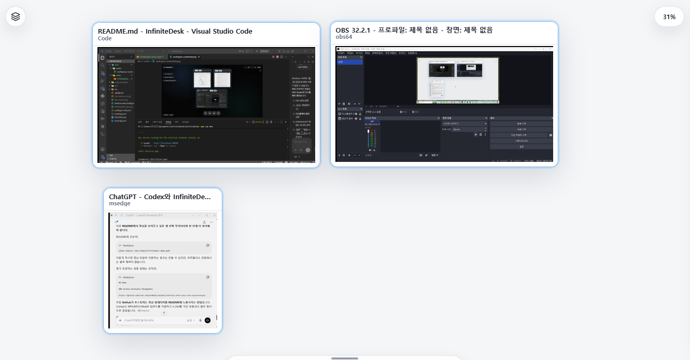
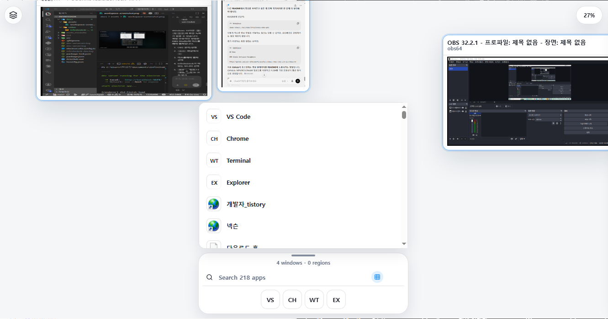
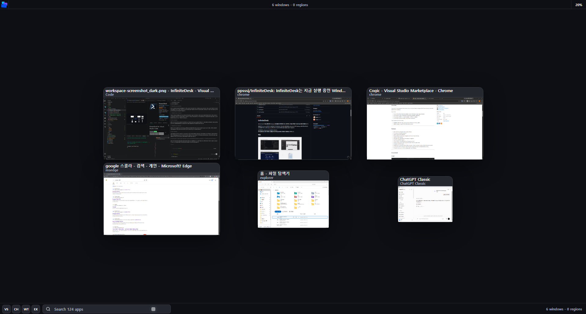

# InfiniteDesk

<p align="center">
  
</p>

InfiniteDesk는 **지금 실행 중인 Windows 앱 창들을 한 화면에서 보고, 정리하고, 직접 조작할 수 있는 데스크톱 컨트롤러**입니다.

예를 들어 VS Code, 브라우저, OBS처럼 이미 켜져 있는 다른 프로그램 창들을 InfiniteDesk 안의 Workspace에서 한눈에 보고, 창 위치를 바꾸고, 실제 Windows 창에 포커스/최소화/최대화 같은 명령을 보낼 수 있습니다.

쉽게 말하면, InfiniteDesk는 앱 런처가 아닙니다.  
**이미 실행 중인 다른 프로세스 창들을 하나의 작업 공간에서 조망하고 제어하는 도구**입니다.

## 데모


[MP4 데모 영상 보기](docs/video/infinitedesk_demo.mp4)







## 무엇을 할 수 있나

- 현재 열려 있는 Windows 창을 자동으로 찾습니다.
- 찾은 창들을 InfiniteDesk Workspace 안에 노드로 보여줍니다.
- 각 노드 안에서 실제 앱 화면을 미리보기로 볼 수 있습니다.
- 노드를 드래그해서 창 배치를 정리할 수 있습니다.
- 정리한 배치를 실제 Windows 창 위치에 적용할 수 있습니다.
- InfiniteDesk 안에서 원본 창에 포커스, 최소화, 최대화, 복원, 닫기 명령을 보낼 수 있습니다.
- 노드 안의 미리보기에서 클릭, 드래그, 스크롤 같은 입력을 원본 앱 창으로 전달할 수 있습니다.
- 자주 쓰는 창 배치를 Region과 Template으로 저장할 수 있습니다.
- Dock에서 앱을 검색하고 실행할 수 있습니다.
- Native Overlay 모드로 실제 데스크톱 위에 InfiniteDesk를 제어 레이어처럼 띄울 수 있습니다.

## 핵심 아이디어

보통 Electron 앱은 자기 앱 안의 UI만 다룹니다.  
InfiniteDesk는 여기서 한 단계 더 나아가, **앱 밖에서 실행 중인 실제 Windows 창**을 다룹니다.

InfiniteDesk가 하는 일은 크게 네 가지입니다.

1. Windows에 떠 있는 실제 창 목록을 가져옵니다.
2. 각 창을 Workspace 안의 카드처럼 보여줍니다.
3. 사용자가 카드 위치를 바꾸면 그 배치를 저장합니다.
4. 필요할 때 그 배치를 실제 Windows 창 위치와 크기에 반영합니다.

즉, 화면에 보이는 노드는 단순한 가짜 카드가 아니라 실제 Windows 창과 연결된 컨트롤 포인트입니다.

## 사용 흐름

1. InfiniteDesk를 실행합니다.
2. `Scan Windows` 또는 `Ctrl + R`로 현재 열린 창을 스캔합니다.
3. Workspace에서 여러 앱 창의 미리보기를 확인합니다.
4. 창 노드를 드래그해서 원하는 작업 배치를 만듭니다.
5. 필요한 경우 `Ctrl + Drag`로 Region을 만들고 창을 묶습니다.
6. `Save Regions`로 자주 쓰는 배치를 Template으로 저장합니다.
7. `Apply Layout`으로 Workspace의 배치를 실제 Windows 창에 적용합니다.
8. Mirror Control이나 Native Overlay로 InfiniteDesk 안에서 원본 창을 조작합니다.

## 왜 만들었나

여러 앱을 동시에 쓰다 보면 창이 금방 많아집니다. 어떤 창이 어디 있는지 찾기 어렵고, 작업을 시작할 때마다 창 위치를 다시 맞추는 것도 번거롭습니다.

InfiniteDesk는 이 문제를 해결하기 위해 만들었습니다.

- 여러 앱 창을 한 번에 보고 싶다.
- 작업별 창 배치를 저장하고 싶다.
- 저장한 배치를 실제 데스크톱에 다시 적용하고 싶다.
- 앱을 새로 감싸지 않고, 원래 실행 중인 창을 그대로 제어하고 싶다.

## 어떻게 동작하나

InfiniteDesk는 원본 앱을 복제하거나 새 컨테이너 안에 넣지 않습니다.  
대신 Windows가 제공하는 창 핸들(HWND)과 DWM 미리보기, Win32 API를 사용합니다.

- `EnumWindows`로 현재 실행 중인 창 목록을 가져옵니다.
- 창 제목, 프로세스명, 위치, 크기, 최소화 상태를 읽습니다.
- DWM thumbnail로 원본 창 화면을 Workspace 노드 안에 보여줍니다.
- `MoveWindow`, `SetWindowPos`, `ShowWindow`, `SetForegroundWindow` 같은 Win32 명령으로 실제 창을 제어합니다.
- Mirror Control은 노드 안에서 발생한 마우스 입력을 원본 창의 좌표로 바꿔 전달합니다.

## 기술 구조

```text
React Renderer
  |
  | Context-isolated Preload API
  v
Electron Main Process
  |
  +-- PowerShell / Win32 Window Control
  |     |
  |     +-- EnumWindows
  |     +-- GetWindowText / GetWindowRect
  |     +-- MoveWindow / SetWindowPos
  |     +-- ShowWindow / SetForegroundWindow
  |     +-- Mirrored pointer input
  |
  +-- DWM Preview Host
        |
        +-- DwmRegisterThumbnail
        +-- DwmUpdateThumbnailProperties
```

## 구현 포인트

- Electron의 Main, Renderer, Preload를 분리했습니다.
- Renderer는 Workspace, Dock, Drawer, Template UI를 담당합니다.
- Main Process는 IPC를 통해 창 스캔, 레이아웃 적용, Overlay 전환, 앱 실행을 처리합니다.
- Windows 창 제어는 PowerShell에서 Win32 API를 호출하는 방식으로 구현했습니다.
- 실제 창 미리보기는 DWM thumbnail host를 통해 동기화합니다.
- Template과 Workspace 데이터는 Electron `userData` 경로에 JSON 파일로 저장합니다.

## 실행 방법

### 요구 사항

- Windows 10 또는 Windows 11
- Node.js 20 이상 권장
- npm
- PowerShell 5.1 이상

### 설치

```bash
npm install
```

### 개발 실행

```bash
npm run dev
```

### 검증

```bash
npm run typecheck
npm test
npm run build
```

### Windows 패키징

```bash
# 설치 없이 패키징 결과 확인
npm run package:dir

# NSIS 설치 프로그램 생성
npm run package:win

# 단일 포터블 실행 파일 생성
npm run package:portable
```

생성된 파일은 `release/`에 저장됩니다. 공개 배포본은 Windows 코드 서명을 적용한 뒤 배포하는 것을 권장합니다.

## 개인정보와 보안

- [개인정보 처리 안내](PRIVACY.md)
- [보안 취약점 신고 정책](SECURITY.md)

## 단축키

- `Ctrl + R`: Windows 창 스캔
- `Ctrl + S`: Region Template 저장
- `Ctrl + Enter`: 현재 Workspace 레이아웃 적용
- `Ctrl + 0`: Workspace 화면 맞춤
- `Ctrl + Shift + O`: Native Overlay 전환
- `Esc`: 메뉴와 Drawer 닫기

## 프로젝트 구조

```text
src/
  main/
    index.ts                 Electron main process와 IPC handler
    window-control-host.ps1  Win32 창 스캔/제어 상주 프로세스
    dwm-preview-host.ps1     DWM live preview host
  preload/
    index.ts              Renderer에 노출되는 안전한 IPC bridge
  renderer/
    main.tsx              React application shell
    styles.css            Workspace, Dock, Drawer, control styling
    canvas/               좌표 변환, 창 배치, Region helper
    components/           CanvasPreview, Dock component
    dock/                 기본 Dock 앱 정의
  shared/
    types.ts              Main/Renderer 공용 타입
docs/
  assets/
    workspace-screenshot1.png
    workspace-screenshot2.png
    workspace-screenshot-dark.png
  video/
    infinitedesk_demo.mp4
    infinitedesk_demo.gif
```

## 현재 한계

- Windows 보안 정책이나 앱별 입력 처리 방식에 따라 일부 창 제어가 제한될 수 있습니다.
- 관리자 권한으로 실행된 앱, Chromium 계열 앱, Electron 앱은 환경에 따라 다르게 동작할 수 있습니다.
- DWM 미리보기는 네이티브 레이어로 동작하기 때문에 창 단위 녹화 도구에서는 실제 프로세스 화면이 빠질 수 있습니다. 녹화할 때는 OBS의 Display Capture처럼 모니터 화면 전체를 캡처하는 방식이 적합합니다.
- 멀티 모니터 레이아웃 저장/복원은 아직 깊게 모델링하지 않았습니다.
- Dock 앱 목록은 기본 앱과 로컬 검색 결과를 조합하며, 사용자가 직접 편집하는 기능은 아직 없습니다.

## 다음 개선 방향

- Native Overlay와 Mirror Control 안정성 개선
- Region 단위 Apply / Launch workflow 강화
- Dock 앱 편집 및 고정 기능 추가
- 멀티 모니터 Workspace 모델 개선
- PowerShell 기반 Win32 호출을 네이티브 헬퍼로 이전
